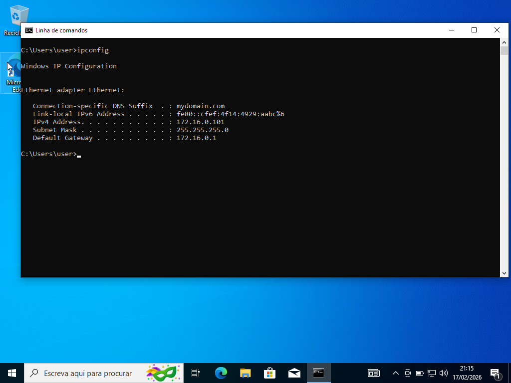
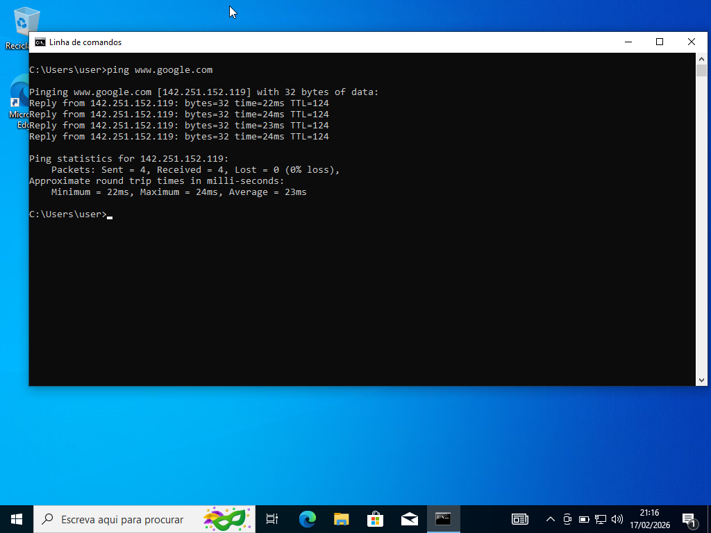
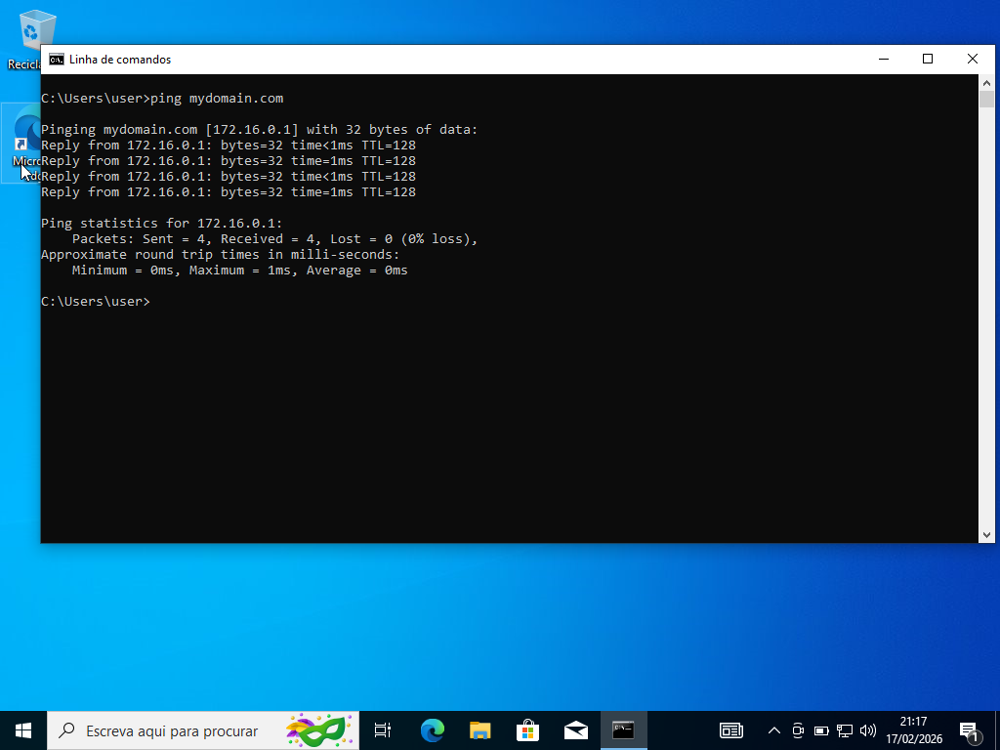
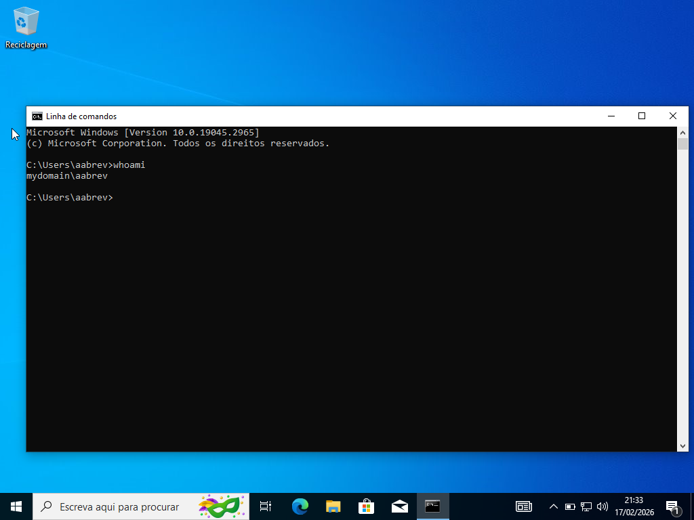

# Home Lab Active Directory - Full Simulation

This project consists of a **fully functional Active Directory lab environment**, built with virtual machines and designed to simulate a real corporate network infrastructure.

The lab integrates core Windows Server services such as:

- Active Directory Domain Services (AD DS)
- DHCP (Dynamic Host Configuration Protocol)
- NAT / Routing and Remote Access Services (RAS)
- DNS (integrated with AD)
- PowerShell automation for large-scale user provisioning

The infrastructure was designed not only to deploy a domain environment, but also to simulate real-world network behavior including:

- Dynamic IP assignment
- Internal DNS name resolution
- Internet access through NAT
- Domain join operations
- Centralized authentication and authorization
---

## Objective

- Simulate a real corporate AD environment.
- Deploy and configure AD DS, DHCP, DNS, and NAT/RAS services
- Automatically create 1,000 domain users using PowerShell scripting
- Configure and validate domain-joined Windows 10 clients
- Test authentication, DNS resolution, and network connectivity
- Document the full infrastructure step by step

---

## Environment Structure

- **Domain Controller (DC)**: Windows Server 2019
- **Network Adapters**:
  - Adapter 1: NAT (Internet)
  - Adapter 2: Internal Network
    - IP: 172.16.0.1
    - Subnet: 255.255.255.0
    - DNS: 127.0.0.1
- **Installed Services**: AD DS, DHCP, NAT/RAS
- **DHCP Scope Configuration**:
  - IP Range: 172.16.0.100 – 172.16.0.200
  - Subnet Mask: 255.255.255.0
  - Default Gateway: 172.16.0.1
  - DNS Server: 172.16.0.1
  - Domain Name: mydomain.com
- **Clients**: Windows 10 VM (domain-joined)
  - IP Address: Assigned dynamically (e.g., 172.16.0.101)
  - Subnet Mask: 255.255.255.0
  - Default Gateway: 172.16.0.1
  - DNS Server: 172.16.0.1
  - Hostname example: CLIENT1

---

## Step-by-Step

### 1️⃣ Windows Server 2019 Installation and Network Configuration
- Create a VM with two network adapters:
  - **Internet NIC (_INTERNET_)** → NAT
  

  - **Internal NIC (_X_internal_X_)** → Manual IP 172.16.0.1  
  

---

### 2️⃣ Active Directory Configuration
- Install Active Directory Domain Services via Server Manager.
- Create a new **forest**: `mydomain.com`
- Restart the server.
- Create an **admin account** and OU `_ADMINS`:
  - User: `a-toliveira` (Password1)  
  
- Log in using the created admin account.

---

### 3️⃣ NAT / RAS Configuration
- Allow Windows 10 clients to access the Internet through the DC.
- Configuration path:
  - Server Manager → Remote Access → Routing and Remote Access → Network Address Translation (NAT)  
  

---

### 4️⃣ DHCP Configuration
- Configure a new scope:
  - IP range: 172.16.0.100 – 172.16.0.200
  - Gateway: 172.16.0.1
  - DNS: 127.0.0.1
  - Domain Name: `mydomain.com`  
  

---

### 5️⃣ Creating 1,000 Users via PowerShell
- Script: `scripts/create-users.ps1`
- Default password: `Password1`
- Username format: first letter of the first name + last name (e.g., Tomas Oliveira → `toliveira`)
- Procedure:
  1. Read `name.txt` containing the list of names.
  2. Convert the password into a secure string object.
  3. Create the `_USERS` OU.
  4. Loop through the list and create each user in AD.  
    
  

---

### 6️⃣ Windows 10 Client Configuration
- Windows 10 VM configured with an internal network adapter.
- Receives IP from the DC:
  - IP: 172.16.0.101
  - Subnet: 255.255.255.0
  - Gateway: 172.16.0.1  
  
- Tests:
  - `ping www.google.com` → DNS working
  
  - `ping mydomain.com` → Domain resolution successful  
  
- Rename hostname to `CLIENT1` and join it to the domain.
- Verify in DHCP and AD:  
    
  
- Test login with any created user (`aabrev`):
    
