# Home Lab Active Directory - Full Simulation

This project consists of a **fully functional Active Directory lab environment**, built with virtual machines and designed to simulate a real corporate network infrastructure.

The lab integrates core Windows Server services such as:

- Active Directory Domain Services (AD DS)
- DHCP (Dynamic Host Configuration Protocol)
- NAT / Routing and Remote Access Services (RAS)
- DNS (integrated with AD)
- PowerShell automation for large-scale user provisioning

The infrastructure was designed not only to deploy a domain environment, but also to simulate real-world network behavior including:

- Dynamic IP assignment
- Internal DNS name resolution
- Internet access through NAT
- Domain join operations
- Centralized authentication and authorization
---

## Objective

- Simulate a real corporate AD environment.
- Deploy and configure AD DS, DHCP, DNS, and NAT/RAS services
- Automatically create 1,000 domain users using PowerShell scripting
- Configure and validate domain-joined Windows 10 clients
- Test authentication, DNS resolution, and network connectivity
- Document the full infrastructure step by step

---

## Environment Structure

- **Domain Controller (DC)**: Windows Server 2019
- **Network Adapters**:
  - Adapter 1: NAT (Internet)
  - Adapter 2: Internal Network
    - IP: 172.16.0.1
    - Subnet: 255.255.255.0
    - DNS: 127.0.0.1
- **Installed Services**: AD DS, DHCP, NAT/RAS
- **DHCP Scope Configuration**:
  - IP Range: 172.16.0.100 – 172.16.0.200
  - Subnet Mask: 255.255.255.0
  - Default Gateway: 172.16.0.1
  - DNS Server: 172.16.0.1
  - Domain Name: mydomain.com
- **Clients**: Windows 10 VM (domain-joined)
  - IP Address: Assigned dynamically (e.g., 172.16.0.101)
  - Subnet Mask: 255.255.255.0
  - Default Gateway: 172.16.0.1
  - DNS Server: 172.16.0.1
  - Hostname example: CLIENT1
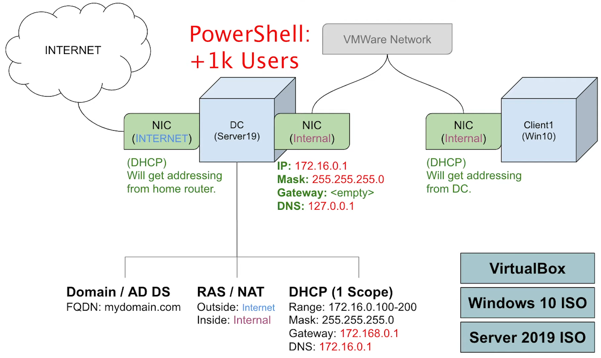

---

## Step-by-Step

### 1️⃣ Windows Server 2019 Installation and Network Configuration
- Download Windows Server 2019 iso file
- Create a VM with two network adapters (NAT + Internal Network)
  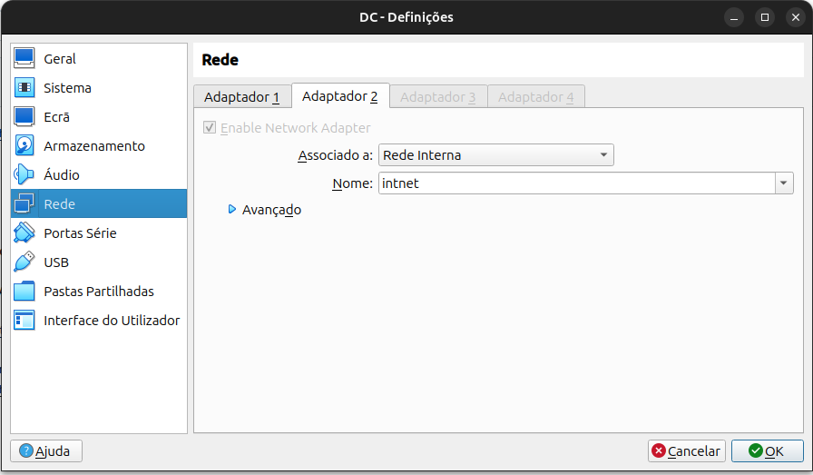

- In Windows Server 2019 go to Settings -> Network & Internet -> Change adapter options

  - **Internet NIC (_INTERNET_)** → NAT and **Internal NIC (_X_internal_X_)** -> Internal Netowrk
  
  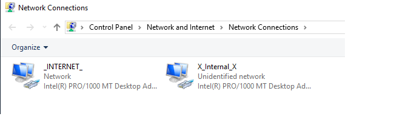

  - **Internal NIC (_X_internal_X_)** → Manual IP 172.16.0.1 
  
  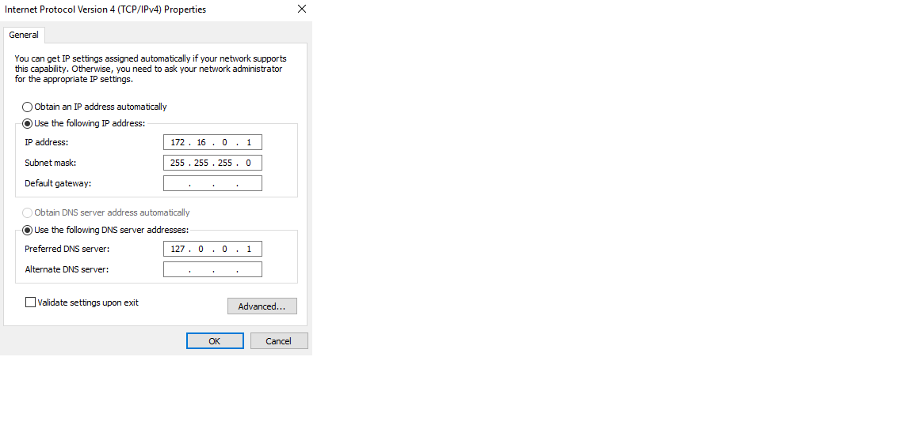

---

### 2️⃣ Active Directory Configuration
- Install Active Directory Domain Services via Server Manager (Add roles and features).
  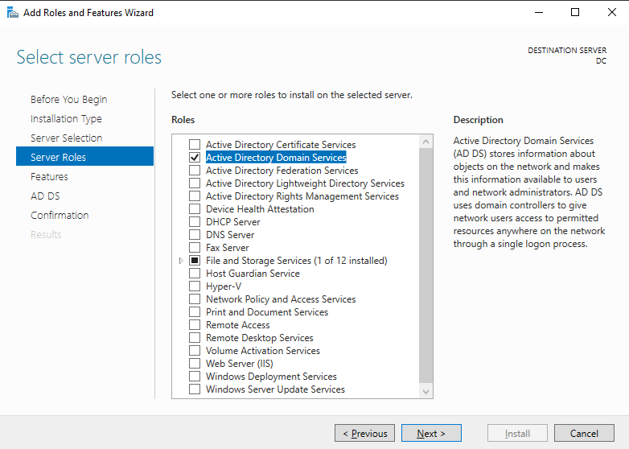
  
- In **Post-deployment Configuration**, Create a new **forest**: `mydomain.com`
- Restart the server.
- Go to **Active Directory Users and Computers**:
  - Create an Organizational Unit (OU) named _ADMINS
  - Create a new user account inside the OU:
  
  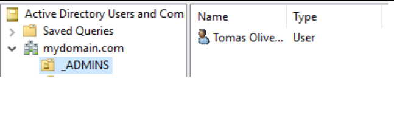
  
- Grant administrative privileges to the account:
  - Right-click in the User -> **Properties** -> **Member of** -> **Add**
  
  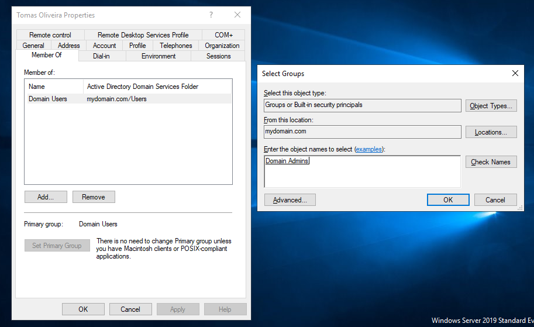
  
  - Click Apply
  
  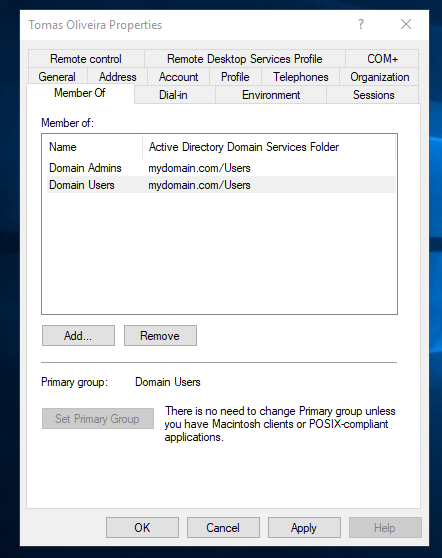
  
- Log in using the newly created admin account.

---

### 3️⃣ NAT / RAS Configuration
- Allow Windows 10 clients to access the Internet through the DC.
- Install Remote Access via Server Manager (Add roles and features)
  - Select Routing
- Configuration path:
  - Server Manager → Tools → Routing and Remote Access
    - DC (local) → Configure and Enable Routing and Remote Access → NAT
  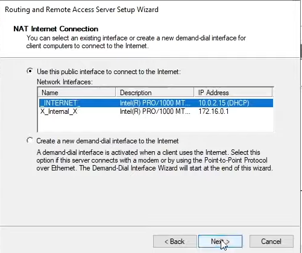

---

### 4️⃣ DHCP Configuration
- Install **DHCP Server** via Server Manager (Add roles and features)
- Configuration path:
  - Server Manager → Tools → DHCP
    - **IPv4** → **New Scope** 
      - Define IP range: 172.16.0.100 – 172.16.0.200
      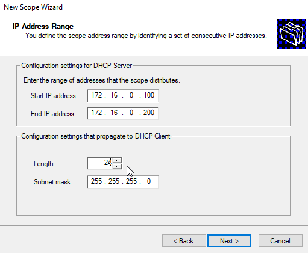
      
      
      - Set the **Default Gateway**: 172.16.0.1
      
      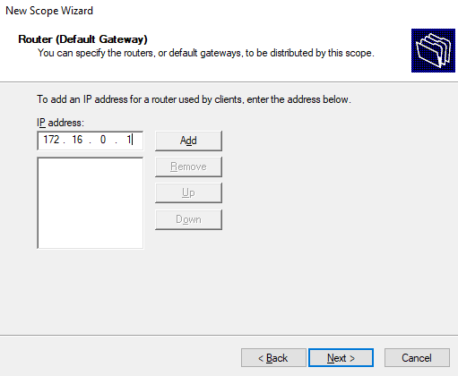
      
      
      - Configure **DNS settings**:
        - Parent domain: `mydomain.com`
        - Preferred DNS server: 172.16.0.1
      
      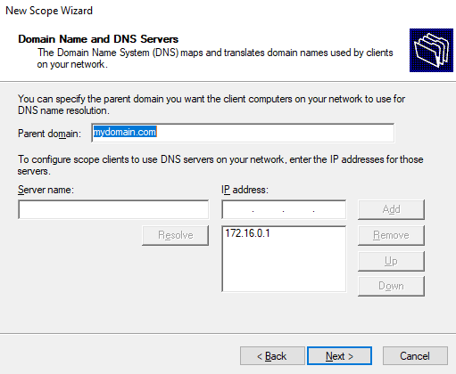
      
    - Authorized the DHCP Server
      - Right-click the DHCP server → **Authorize**
    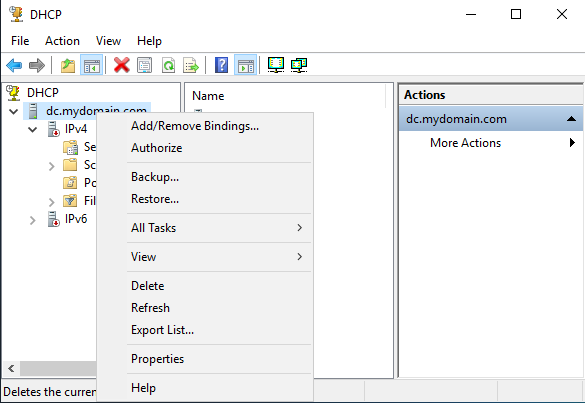

---

### 5️⃣ Creating 1,000 Users via PowerShell
- Script: `scripts/create-users.ps1`
- Username format: first letter of the first name + last name (e.g., Tomas Oliveira → `toliveira`)
- **Procedure**:
  1. Read `name.txt` containing the list of names
  2. Convert the password into a **secure string**
  3. Create the `_USERS` OU.
  4. Loop through the list and create each user in AD. 
- Copy the entire scripts folder to the Windows Server 2019 machine
- Open **PowerShell ISE** as Administrator
  - Set the execution policy:
    - `Set-ExecutionPolicy Unrestricted` (⚠️ For lab use only — not recommended in production environments)
    
  - Navigate to the script directory (/scripts)
  - Run the script (Click **Run** / **Play**)
  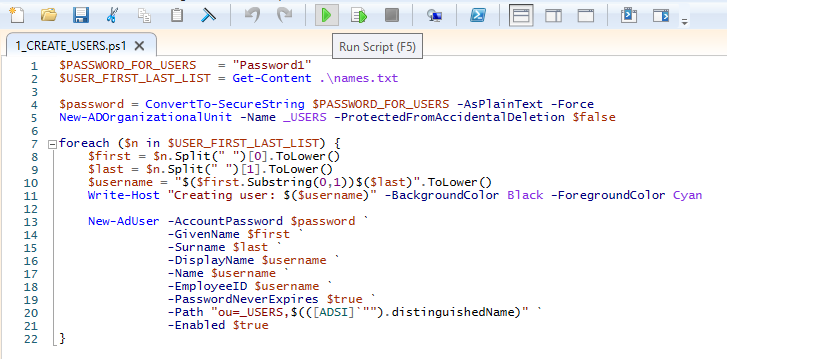 
  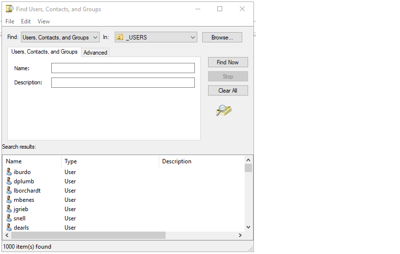

---

### 6️⃣ Windows 10 Client Configuration
- Create and configure a Windows 10 VM with an **internal network** adapter.
- Receives IP from the DC:
  - IP: 172.16.0.101
  - Subnet: 255.255.255.0
  - Gateway: 172.16.0.1 
  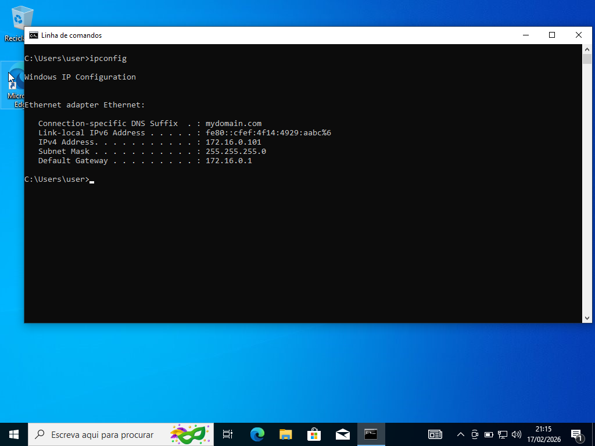
- Tests:
  - `ping www.google.com` → DNS working
  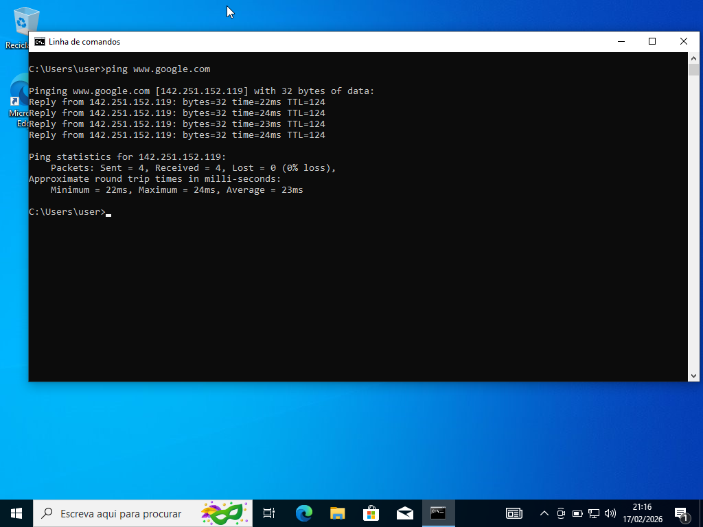
  - `ping mydomain.com` → Domain resolution successful  
  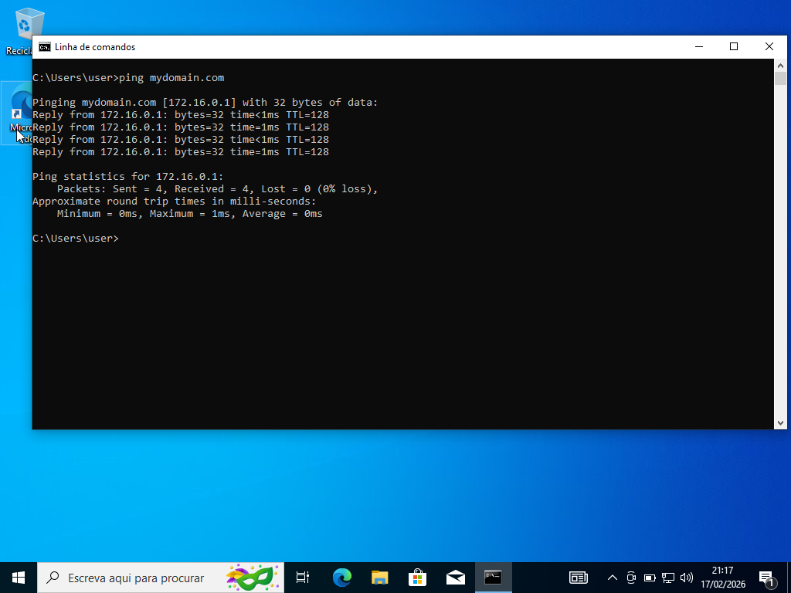

- Rename hostname to `CLIENT1` and join it to the domain.
  - **Rename this PC (advanced)** → Change
    - Change from DESKTOP-... **to CLIENT1**
    - Member of Domain: **mydomain.com**
- Verify in DHCP and AD: 
  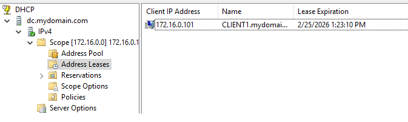  
  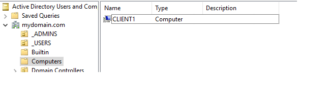
- Test login with any created user (`aabrev`):
    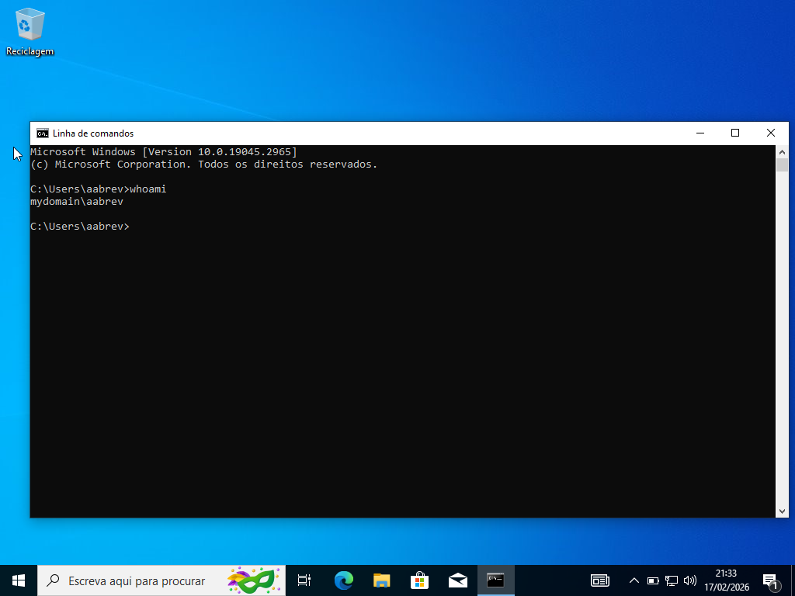
